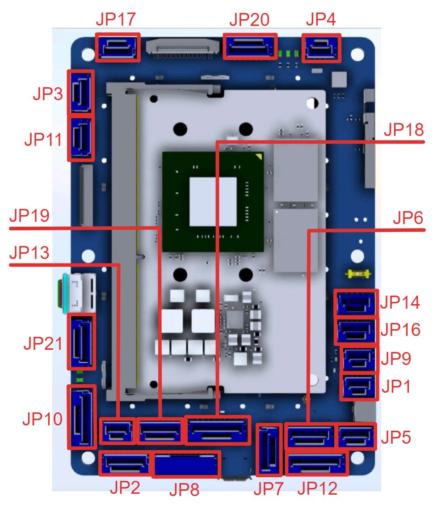
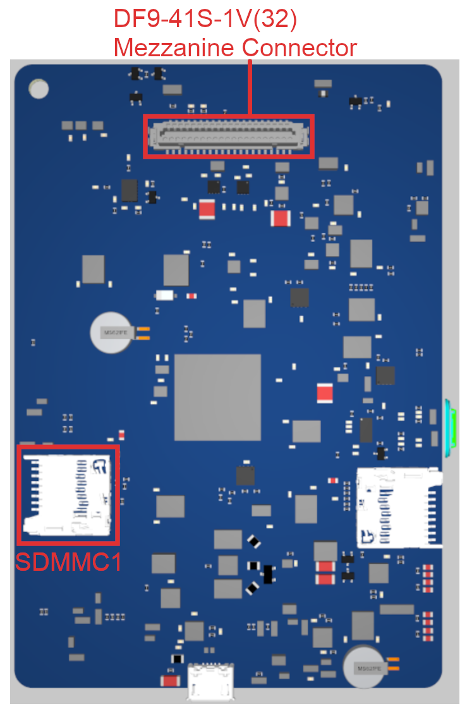

# UltraBlue Flight Controller

The UltraBlue flight controller is sold by [GreenSight](https://greensightag.com).

## Features

 - STM32H743 microcontroller
 - Incorporates an NVIDIA Jetson SOM
 - Three IMUs: two BMI088 units and one ICM20649
 - Internal heater for IMU temperature control
 - DPS310 SPI barometer
 - microSD card slot
 - DF9-41S-1V(32) Hirose Mezzanine Connector

## Connector Overview

## UART Mapping

 - SERIAL0 -> USB (console)
 - SERIAL1 -> USART2 (telem1)
 - SERIAL2 -> USART6 (telem2)
 - SERIAL3 -> USART1 (primary GPS)
 - SERIAL4 -> UART4 (GPS2)
 - SERIAL5 -> UART8 (USER/[RCin: DSM/PPM/SBus])
 - SERIAL6 -> USART3 (ESC telemetry)
 - SERIAL7 -> UART7 (USER/[debug tx/rx])
 - SERIAL8 -> USB2

## Connectors

All connectors are JST GH type unless otherwise specified.

### JP1 - PPM/SBUS In (Autopilot RC input)

   <table border="1" class="docutils">
   <tbody>
   <tr>
   <th>Pin</th>
   <th>Name</th>
   <th>Signal</th>
   <th>Volt</th>
   </tr>
   <tr>
   <td>1</td>
   <td>PPM-SBUS-PORT</td>
   <td>PPM/SBUS</td>
   <td>+3.3V</td>
   </tr>
   <tr>
   <td>2</td>
   <td>5V_Periph</td>
   <td>VCC</td>
   <td>+5V</td>
   </tr>
   <tr>
   <td>3</td>
   <td>Ground</td>
   <td>GND</td>
   <td>GND</td>
   </tr>
   </tbody>
   </table>

### JP9 - Analog (Autopilot ADC input)

   <table border="1" class="docutils">
   <tbody>
   <tr>
   <th>Pin</th>
   <th>Name</th>
   <th>Signal</th>
   <th>Volt</th>
   </tr>
   <tr>
   <td>1</td>
   <td>5V_Periph</td>
   <td>VCC</td>
   <td>+5V</td>
   </tr>
   <tr>
   <td>2</td>
   <td>PRESSURE_SENS_IN</td>
   <td>Autopilot Analog Input</td>
   <td>Analog 0 to +6.6V</td>
   </tr>
   <tr>
   <td>3</td>
   <td>Ground</td>
   <td>GND</td>
   <td>GND</td>
   </tr>
   </tbody>
   </table>

### JP16 - API2C4 (Autopilot I2C)

   <table border="1" class="docutils">
   <tbody>
   <tr>
   <th>Pin</th>
   <th>Name</th>
   <th>Signal</th>
   <th>Volt</th>
   </tr>
   <tr>
   <td>1</td>
   <td>5V_Periph</td>
   <td>VCC</td>
   <td>+5V</td>
   </tr>
   <tr>
   <td>2</td>
   <td>I2C4_SCL</td>
   <td>Autopilot I2C Bus 4 Clock</td>
   <td>+3.3V</td>
   </tr>
   <tr>
   <td>3</td>
   <td>I2C4_SDA</td>
   <td>Autopilot I2C Bus 4 Data</td>
   <td>+3.3V</td>
   </tr>
   <tr>
   <td>4</td>
   <td>Ground</td>
   <td>GND</td>
   <td>GND</td>
   </tr>
   </tbody>
   </table>

### JP14 - AP Debug (Autopilot debug UART)

   <table border="1" class="docutils">
   <tbody>
   <tr>
   <th>Pin</th>
   <th>Name</th>
   <th>Signal</th>
   <th>Volt</th>
   </tr>
   <tr>
   <td>1</td>
   <td>5V_Periph</td>
   <td>VCC</td>
   <td>+5V</td>
   </tr>
   <tr>
   <td>2</td>
   <td>DEBUG_TX</td>
   <td>Autopilot Debug UART Transmit</td>
   <td>+3.3V</td>
   </tr>
   <tr>
   <td>3</td>
   <td>DEBUG_RX</td>
   <td>Autopilot Debug UART Receive</td>
   <td>+3.3V</td>
   </tr>
   <tr>
   <td>4</td>
   <td>Ground</td>
   <td>GND</td>
   <td>GND</td>
   </tr>
   </tbody>
   </table>

### JP4 - Spektrum/DSM (Autopilot RC input)

   <table border="1" class="docutils">
   <tbody>
   <tr>
   <th>Pin</th>
   <th>Name</th>
   <th>Signal</th>
   <th>Volt</th>
   </tr>
   <tr>
   <td>1</td>
   <td>DSM_3V3</td>
   <td>VCC</td>
   <td>+3.3V</td>
   </tr>
   <tr>
   <td>2</td>
   <td>Ground</td>
   <td>GND</td>
   <td>GND</td>
   </tr>
   <tr>
   <td>3</td>
   <td>DSM&SBUS_IN</td>
   <td>Spektrum/DSM</td>
   <td>+3.3V</td>
   </tr>
   </tbody>
   </table>

### JP18 - Autopilot SPI

   <table border="1" class="docutils">
   <tbody>
   <tr>
   <th>Pin</th>
   <th>Name</th>
   <th>Signal</th>
   <th>Volt</th>
   </tr>
   <tr>
   <td>1</td>
   <td>5V_Periph</td>
   <td>VCC</td>
   <td>+5V</td>
   </tr>
   <tr>
   <td>2</td>
   <td>SPI5_SCK</td>
   <td>SPI5 Clock</td>
   <td>+3.3V</td>
   </tr>
   <tr>
   <td>3</td>
   <td>SPI5_MISO</td>
   <td>SPI5 Master In Slave Out</td>
   <td>+3.3V</td>
   </tr>
   <tr>
   <td>4</td>
   <td>SPI5_MOSI</td>
   <td>SPI5 Master Out Slave In</td>
   <td>+3.3V</td>
   </tr>
   <tr>
   <td>5</td>
   <td>SPI5_EXT1_CS1</td>
   <td>SPI5 External Chip</td>
   <td>+3.3V</td>
   </tr>
   <tr>
   <td>6</td>
   <td>SPI5_EXT1_CS2</td>
   <td>SPI5 External Chip Select 2</td>
   <td>+3.3V</td>
   </tr>
   <tr>
   <td>7</td>
   <td>SPI5_EXT1_CS3</td>
   <td>SPI5 External Chip Select 3</td>
   <td>+3.3V</td>
   </tr>
   <tr>
   <td>8</td>
   <td>Ground</td>
   <td>GND</td>
   <td>GND</td>
   </tr>
   </tbody>
   </table>

### JP17 - Cooling Fan (Companion Computer)

   <table border="1" class="docutils">
   <tbody>
   <tr>
   <th>Pin</th>
   <th>Name</th>
   <th>Signal</th>
   <th>Volt</th>
   </tr>
   <tr>
   <td>1</td>
   <td>Ground</td>
   <td>GND</td>
   <td>GND</td>
   </tr>
   <tr>
   <td>2</td>
   <td>5V_JET</td>
   <td>VCC</td>
   <td>+5V</td>
   </tr>
   <tr>
   <td>3</td>
   <td>JET_GPIO08</td>
   <td>Jetson PWM Tach Input</td>
   <td>+3.3V</td>
   </tr>
   <tr>
   <td>4</td>
   <td>JET_GPIO14</td>
   <td>Jetson PWM Fan Output</td>
   <td>+3.3V</td>
   </tr>
   </tbody>
   </table>

### JP3 - CAN 1 (Autopilot and Jetson Companion Computer)

   <table border="1" class="docutils">
   <tbody>
   <tr>
   <th>Pin</th>
   <th>Name</th>
   <th>Signal</th>
   <th>Volt</th>
   </tr>
   <tr>
   <td>1</td>
   <td>5V_CAN</td>
   <td>VCC</td>
   <td>+5V</td>
   </tr>
   <tr>
   <td>2</td>
   <td>CAN_H_1</td>
   <td>Autopilot and Jetson CAN High</td>
   <td>+3.3V</td>
   </tr>
   <tr>
   <td>3</td>
   <td>CAN_L_1</td>
   <td>Autopilot and Jetson CAN Low</td>
   <td>+3.3V</td>
   </tr>
   <tr>
   <td>4</td>
   <td>Ground</td>
   <td>GND</td>
   <td>GND</td>
   </tr>
   </tbody>
   </table>

### JP11 - CAN 2 (Autopilot)

   <table border="1" class="docutils">
   <tbody>
   <tr>
   <th>Pin</th>
   <th>Name</th>
   <th>Signal</th>
   <th>Volt</th>
   </tr>
   <tr>
   <td>1</td>
   <td>5V_CAN</td>
   <td>VCC</td>
   <td>+5V</td>
   </tr>
   <tr>
   <td>2</td>
   <td>CAN_H_2</td>
   <td>Autopilot only CAN High</td>
   <td>+3.3V</td>
   </tr>
   <tr>
   <td>3</td>
   <td>CAN_L_2</td>
   <td>Autopilot only CAN Low</td>
   <td>+3.3V</td>
   </tr>
   <tr>
   <td>4</td>
   <td>Ground</td>
   <td>GND</td>
   <td>GND</td>
   </tr>
   </tbody>
   </table>

### JP10 - Ethernet (Companion Computer)

NOTE: JP10 is a capacitively coupled ethernet port due to space constraints. It officially supports 10/100 communication over 4x of the pins, MDI pairs 0 and 1, which would correspond to pins 1, 2, 3, and 6 on a standard RJ-45 end (Orange and Green ethernet cable/RJ-45 pairs). Even though these pairs are capacitively coupled, full Gigabit capability has been tested and verified in the lab with all 8x pins in use; the caveat is that this test was done with a cable ~1m long. Speeds above 10/100 may be unstable with longer cable lengths and are not guaranteed. Dual 10/100 connections may also be possible, though this is entirely dependent on the capabilities of the Jetson module itself.

   <table border="1" class="docutils">
   <tbody>
   <tr>
   <th>Pin</th>
   <th>Name</th>
   <th>Signal</th>
   <th>Volt</th>
   </tr>
   <tr>
   <td>1</td>
   <td>JET_GBE_MDI3_P</td>
   <td>Jetson Ethernet (Cap Coupled)</td>
   <td>+3.3V</td>
   </tr>
   <tr>
   <td>2</td>
   <td>JET_GBE_MDI3_N</td>
   <td>Jetson Ethernet (Cap Coupled)</td>
   <td>+3.3V</td>
   </tr>
   <tr>
   <td>3</td>
   <td>JET_GBE_MDI2_P</td>
   <td>Jetson Ethernet (Cap Coupled)</td>
   <td>+3.3V</td>
   </tr>
   <tr>
   <td>4</td>
   <td>JET_GBE_MDI2_N</td>
   <td>Jetson Ethernet (Cap Coupled)</td>
   <td>+3.3V</td>
   </tr>
   <tr>
   <td>5</td>
   <td>JET_GBE_MDI1_P</td>
   <td>Jetson Ethernet (Cap Coupled) 10/100</td>
   <td>+3.3V</td>
   </tr>
   <tr>
   <td>6</td>
   <td>JET_GBE_MDI1_N</td>
   <td>Jetson Ethernet (Cap Coupled) 10/100</td>
   <td>+3.3V</td>
   </tr>
   <tr>
   <td>7</td>
   <td>JET_GBE_MDI0_P</td>
   <td>Jetson Ethernet (Cap Coupled) 10/100</td>
   <td>+3.3V</td>
   </tr>
   <tr>
   <td>8</td>
   <td>JET_GBE_MDI0_N</td>
   <td>Jetson Ethernet (Cap Coupled) 10/100</td>
   <td>+3.3V</td>
   </tr>
   </tbody>
   </table>

### JP13 - Jetson Debug (Companion Computer UART)

   <table border="1" class="docutils">
   <tbody>
   <tr>
   <th>Pin</th>
   <th>Name</th>
   <th>Signal</th>
   <th>Volt</th>
   </tr>
   <tr>
   <td>1</td>
   <td>JET_UART2_TX</td>
   <td>Jetson UART Debug Transmit</td>
   <td>+3.3V</td>
   </tr>
   <tr>
   <td>2</td>
   <td>JET_UART2_RX</td>
   <td>Jetson UART Debug Receive</td>
   <td>+3.3V</td>
   </tr>
   <tr>
   <td>3</td>
   <td>Ground</td>
   <td>GND</td>
   <td>GND</td>
   </tr>
   </tbody>
   </table>

### JP2 - AP Telem 2 (Autopilot UART)

   <table border="1" class="docutils">
   <tbody>
   <tr>
   <th>Pin</th>
   <th>Name</th>
   <th>Signal</th>
   <th>Volt</th>
   </tr>
   <tr>
   <td>1</td>
   <td>5V_HP</td>
   <td>VCC</td>
   <td>+5V</td>
   </tr>
   <tr>
   <td>2</td>
   <td>TELEM2_TX</td>
   <td>Autopilot Telem 2 UART Transmit</td>
   <td>+3.3V</td>
   </tr>
   <tr>
   <td>3</td>
   <td>TELEM2_RX</td>
   <td>Autopilot Telem 2 UART Receive</td>
   <td>+3.3V</td>
   </tr>
   <tr>
   <td>4</td>
   <td>TELEM2_CTS</td>
   <td>Autopilot Telem 2 UART Clear to Send</td>
   <td>+3.3V</td>
   </tr>
   <tr>
   <td>5</td>
   <td>TELEM2_RTS</td>
   <td>Autopilot Telem 2 UART Request to Send</td>
   <td>+3.3V</td>
   </tr>
   <tr>
   <td>6</td>
   <td>Ground</td>
   <td>GND</td>
   <td>GND</td>
   </tr>
   </tbody>
   </table>

### JP19 - JET_SER_1 (Companion Computer UART)

   <table border="1" class="docutils">
   <tbody>
   <tr>
   <th>Pin</th>
   <th>Name</th>
   <th>Signal</th>
   <th>Volt</th>
   </tr>
   <tr>
   <td>1</td>
   <td>5V_HP</td>
   <td>VCC</td>
   <td>+5V</td>
   </tr>
   <tr>
   <td>2</td>
   <td>JET_UART1_TX</td>
   <td>Jetson UART 1 Transmit</td>
   <td>+3.3V</td>
   </tr>
   <tr>
   <td>3</td>
   <td>JET_UART1_RX</td>
   <td>Jetson UART 1 Receive</td>
   <td>+3.3V</td>
   </tr>
   <tr>
   <td>4</td>
   <td>JET_UART1_CTS_N</td>
   <td>Jetson UART 1 Clear to Send</td>
   <td>+3.3V</td>
   </tr>
   <tr>
   <td>5</td>
   <td>JET_UART1_RTS_N</td>
   <td>Jetson UART 1 Request to Send</td>
   <td>+3.3V</td>
   </tr>
   <tr>
   <td>6</td>
   <td>Ground</td>
   <td>GND</td>
   <td>GND</td>
   </tr>
   </tbody>
   </table>

### JP8 - RGB LED & Power Button (Autopilot and Companion Computer UI connector)

   <table border="1" class="docutils">
   <tbody>
   <tr>
   <th>Pin</th>
   <th>Name</th>
   <th>Signal</th>
   <th>Volt</th>
   </tr>
   <tr>
   <td>1</td>
   <td>5V_JET</td>
   <td>VCC</td>
   <td>+5V</td>
   </tr>
   <tr>
   <td>2</td>
   <td>LED_R</td>
   <td>RGB LED Driver Red channel (low side)</td>
   <td>+3.3V</td>
   </tr>
   <tr>
   <td>3</td>
   <td>LED_G</td>
   <td>RGB LED Driver Green channel (low side)</td>
   <td>+3.3V</td>
   </tr>
   <tr>
   <td>4</td>
   <td>LED_B</td>
   <td>RGB LED Driver Blue channel (low side)</td>
   <td>+3.3V</td>
   </tr>
   <tr>
   <td>5</td>
   <td>Power_Button</td>
   <td>Power Button pass-thru to power board</td>
   <td>+3.3V</td>
   </tr>
   <tr>
   <td>6</td>
   <td>DELL_1W</td>
   <td>Dell 1W input to Jetson</td>
   <td>+3.3V</td>
   </tr>
   <tr>
   <td>7</td>
   <td>IO-LED_SAFETY_ PROT</td>
   <td>Safety Indicator LED pulse</td>
   <td>+3.3V</td>
   </tr>
   <tr>
   <td>8</td>
   <td>SAFETY_SW_R</td>
   <td>Safety switch input to Autopilot</td>
   <td>+3.3V</td>
   </tr>
   <tr>
   <td>9</td>
   <td>Ground</td>
   <td>GND</td>
   <td>GND</td>
   </tr>
   </tbody>
   </table>

### JP7 - GPS 2 (Autopilot UART/I2C)

   <table border="1" class="docutils">
   <tbody>
   <tr>
   <th>Pin</th>
   <th>Name</th>
   <th>Signal</th>
   <th>Volt</th>
   </tr>
   <tr>
   <td>1</td>
   <td>5V_Periph</td>
   <td>VCC</td>
   <td>+5V</td>
   </tr>
   <tr>
   <td>2</td>
   <td>GPS2_TX</td>
   <td>Autopilot GPS2 UART Transmit</td>
   <td>+3.3V</td>
   </tr>
   <tr>
   <td>3</td>
   <td>GPS2_RX</td>
   <td>Autopilot GPS2 UART Receive</td>
   <td>+3.3V</td>
   </tr>
   <tr>
   <td>4</td>
   <td>I2C2_SCL_GPS2</td>
   <td>Autopilot I2C Bus 2 Clock (GPS2 SCL)</td>
   <td>+3.3V</td>
   </tr>
   <tr>
   <td>5</td>
   <td>I2C2_SDA_GPS2</td>
   <td>Autopilot I2C Bus 2 Data (GPS2 SDA)</td>
   <td>+3.3V</td>
   </tr>
   <tr>
   <td>6</td>
   <td>Ground</td>
   <td>GND</td>
   <td>GND</td>
   </tr>
   </tbody>
   </table>

### JP5 - Jetson I2C (Companion Computer)

   <table border="1" class="docutils">
   <tbody>
   <tr>
   <th>Pin</th>
   <th>Name</th>
   <th>Signal</th>
   <th>Volt</th>
   </tr>
   <tr>
   <td>1</td>
   <td>Ground</td>
   <td>GND</td>
   <td>GND</td>
   </tr>
   <tr>
   <td>2</td>
   <td>JET_I2C1_SCL</td>
   <td>Jetson I2C Bus 1 Clock</td>
   <td>3.3V</td>
   </tr>
   <tr>
   <td>3</td>
   <td>JET_I2C1_SDA</td>
   <td>Jetson I2C Bus 1 Data</td>
   <td>3.3V</td>
   </tr>
   <tr>
   <td>4</td>
   <td>5V_CAN</td>
   <td>VCC</td>
   <td>+5V</td>
   </tr>
   </tbody>
   </table>

### JP6 - GPS 1 (Autopilot UART/I2C)

   <table border="1" class="docutils">
   <tbody>
   <tr>
   <th>Pin</th>
   <th>Name</th>
   <th>Signal</th>
   <th>Volt</th>
   </tr>
   <tr>
   <td>1</td>
   <td>5V_Periph</td>
   <td>VCC</td>
   <td>+5V</td>
   </tr>
   <tr>
   <td>2</td>
   <td>GPS1_TX</td>
   <td>Autopilot GPS1 UART Transmit</td>
   <td>+3.3V</td>
   </tr>
   <tr>
   <td>3</td>
   <td>GPS1_RX</td>
   <td>Autopilot GPS1 UART Receive</td>
   <td>+3.3V</td>
   </tr>
   <tr>
   <td>4</td>
   <td>I2C1_SCL</td>
   <td>Autopilot I2C Bus 1 Clock (GPS1 SCL)</td>
   <td>+3.3V</td>
   </tr>
   <tr>
   <td>5</td>
   <td>I2C1_SDA</td>
   <td>Autopilot I2C Bus 1 Data (GPS1 SDA)</td>
   <td>+3.3V</td>
   </tr>
   <tr>
   <td>6</td>
   <td>Ground</td>
   <td>GND</td>
   <td>GND</td>
   </tr>
   </tbody>
   </table>

### JP20 - JET_SPI (Companion Computer SPI)

   <table border="1" class="docutils">
   <tbody>
   <tr>
   <th>Pin</th>
   <th>Name</th>
   <th>Signal</th>
   <th>Volt</th>
   </tr>
   <tr>
   <td>1</td>
   <td>JET_SPI0_SCK</td>
   <td>Jetson SPI 0 Clock</td>
   <td>+3.3V</td>
   </tr>
   <tr>
   <td>2</td>
   <td>JET_SPI0_CS0_N</td>
   <td>Jetson SPI 0 Chip Select 0</td>
   <td>+3.3V</td>
   </tr>
   <tr>
   <td>3</td>
   <td>JET_SPI0_CS1_N</td>
   <td>Jetson SPI 0 Chip Select 1</td>
   <td>+3.3V</td>
   </tr>
   <tr>
   <td>4</td>
   <td>JET_SPI0_MISO</td>
   <td>Jetson SPI 0 Master-In / Servant-Out</td>
   <td>+3.3V</td>
   </tr>
   <tr>
   <td>5</td>
   <td>JET_SPI0_MOSI</td>
   <td>Jetson SPI 0 Master-Out / Servant-In</td>
   <td>+3.3V</td>
   </tr>
   <tr>
   <td>6</td>
   <td>JET_SP1_SCK</td>
   <td>Jetson SPI 1 Clock</td>
   <td>+3.3V</td>
   </tr>
   <tr>
   <td>7</td>
   <td>JET_SPI1_CS0_N</td>
   <td>Jetson SPI 1 Chip Select 0</td>
   <td>+3.3V</td>
   </tr>
   <tr>
   <td>8</td>
   <td>JET_SPI1_CS1_N</td>
   <td>Jetson SPI 1 Chip Select 1</td>
   <td>+3.3V</td>
   </tr>
   <tr>
   <td>9</td>
   <td>JET_SPI1_MISO</td>
   <td>Jetson SPI 1 Master-In / Servant-Out</td>
   <td>+3.3V</td>
   </tr>
   <tr>
   <td>10</td>
   <td>JET_SPI1_MOSI</td>
   <td>Jetson SPI 1 Master-Out / Servant-In</td>
   <td>+3.3V</td>
   </tr>
   </tbody>
   </table>

### JP12 - AP GPIO (Autopilot GPIOs)
   <table border="1" class="docutils">
   <tbody>
   <tr>
   <th>Pin</th>
   <th>Name</th>
   <th>Signal</th>
   <th>Volt</th>
   </tr>
   <tr>
   <td>1</td>
   <td>5V_Periph</td>
   <td>VCC</td>
   <td>+5V</td>
   </tr>
   <tr>
   <td>2</td>
   <td>FMU_CAP1_PORT</td>
   <td>Autopilot Spare GPIO 1</td>
   <td>+3.3V</td>
   </tr>
   <tr>
   <td>3</td>
   <td>FMU_CAP2_PORT</td>
   <td>Autopilot Spare GPIO 2</td>
   <td>+3.3V</td>
   </tr>
   <tr>
   <td>4</td>
   <td>FMU_CAP3_PORT</td>
   <td>Autopilot Spare GPIO 3</td>
   <td>+3.3V</td>
   </tr>
   <tr>
   <td>5</td>
   <td>FMU_SPARE_4_PORT
   </td>
   <td>Autopilot Spare GPIO 4</td>
   <td>+3.3V</td>
   </tr>
   <tr>
   <td>6</td>
   <td>FMU_CAP5_PORT</td>
   <td>Autopilot Spare GPIO 5</td>
   <td>+3.3V</td>
   </tr>
   <tr>
   <td>7</td>
   <td>FMU_CAP6_PORT</td>
   <td>Autopilot Spare GPIO 6</td>
   <td>+3.3V</td>
   </tr>
   <tr>
   <td>8</td>
   <td>Ground</td>
   <td>GND</td>
   <td>GND</td>
   </tr>
   </tbody>
   </table>

### JP21 - I2S1 (I2C Slave/Connection)

   <table border="1" class="docutils">
   <tbody>
   <tr>
   <th>Pin</th>
   <th>Name</th>
   <th>Signal</th>
   <th>Volt</th>
   </tr>
   <tr>
   <td>1</td>
   <td>5V_JET</td>
   <td>VCC</td>
   <td>+5V</td>
   </tr>
   <tr>
   <td>2</td>
   <td>I2S1_SCLK</td>
   <td>I2S1 Clock</td>
   <td>+3.3V</td>
   </tr>
   <tr>
   <td>3</td>
   <td>I2S1_DIN</td>
   <td>I2S1 Data In</td>
   <td>+3.3V</td>
   </tr>
   <tr>
   <td>4</td>
   <td>I2S1_DOUT</td>
   <td>I2S1 Data Out</td>
   <td>+3.3V</td>
   </tr>
   <tr>
   <td>5</td>
   <td>I2S1_FS</td>
   <td>I2S1 Frame Select</td>
   <td>+3.3V</td>
   </tr>
   <tr>
   <td>6</td>
   <td>Ground</td>
   <td>GND</td>
   <td>GND</td>
   </tr>
   </tbody>
   </table>

### Mezzanine Connector

External Pin Information:
   <table border="1" class="docutils">
   <tbody>
   <tr>
   <th>Pin</th>
   <th>Info</th>
   </tr>
   <tr>
   <td>2</td>
   <td>ESC/Servo Output, 3.3V, Protected</td>
   </tr>
   <tr>
   <td>4</td>
   <td>ESC/Servo Output, 3.3V, Protected</td>
   </tr>
   <tr>
   <td>6</td>
   <td>ESC/Servo Output, 3.3V, Protected</td>
   </tr>
   <tr>
   <td>8</td>
   <td>ESC/Servo Output, 3.3V, Protected</td>
   </tr>
   <tr>
   <td>10</td>
   <td>ESC/Servo Output, 3.3V, Protected</td>
   </tr>
   <tr>
   <td>12</td>
   <td>ESC/Servo Output, 3.3V, Protected</td>
   </tr>
   <tr>
   <td>14</td>
   <td>ESC/Servo Output, 3.3V, Protected</td>
   </tr>
   <tr>
   <td>16</td>
   <td>ESC/Servo Output, 3.3V, Protected</td>
   </tr>
   <tr>
   <td>18</td>
   <td>ESC Telemetry Serial Port Input</td>
   </tr>
   <tr>
   <td>20</td>
   <td>Power Button Signal GPIO, Passed through to button panel JP8</td>
   </tr>
   <tr>
   <td>22</td>
   <td>Jetson Shutdown Request Signal (GPIO19), 3.3v PU, 3.3v Logic</td>
   </tr>
   <tr>
   <td>24</td>
   <td>N/C</td>
   </tr>
   <tr>
   <td>26</td>
   <td>BMS I2C SDA, Switchable between Jetson and AP, 3.3v logic</td>
   </tr>
   <tr>
   <td>28</td>
   <td>BMS I2C SCL, Switchable between Jetson and AP, 3.3v logic</td>
   </tr>
   <tr>
   <td>30</td>
   <td>Batt Voltage Input - Autopilot ADC 0-3.3v, 1k series no divider</td>
   </tr>
   <tr>
   <td>32</td>
   <td>Batt Current Input - Autopilot ADC 0-3.3v, 1k series no divider</td>
   </tr>
   <tr>
   <td>34</td>
   <td>Jetson GPIO Output (Enable Aux Bus 1), (3.3v), Active High to Enable Power</td>
   </tr>
   <tr>
   <td>36</td>
   <td>Jetson GPIO Output (Enable Aux Bus 2), (3.3v)</td>
   </tr>
   <tr>
   <td>38</td>
   <td>Serial LED Controller Output, AP FMU CAP1 Port (3.3v)</td>
   </tr>
   <tr>
   <td>40</td>
   <td>One Wire Bus to Jetson (3.3v PU)</td>
   </tr>
   </tbody>
   </table>

## Camera Control

GPIO 64 (camera trigger) is controlled by RELAY1 (default).  
GPIO 65 (camera trigger return) is controlled by RELAY2 (default).

## Acknowledgements

Thanks to [GreenSight](https://greensightag.com) for images.
